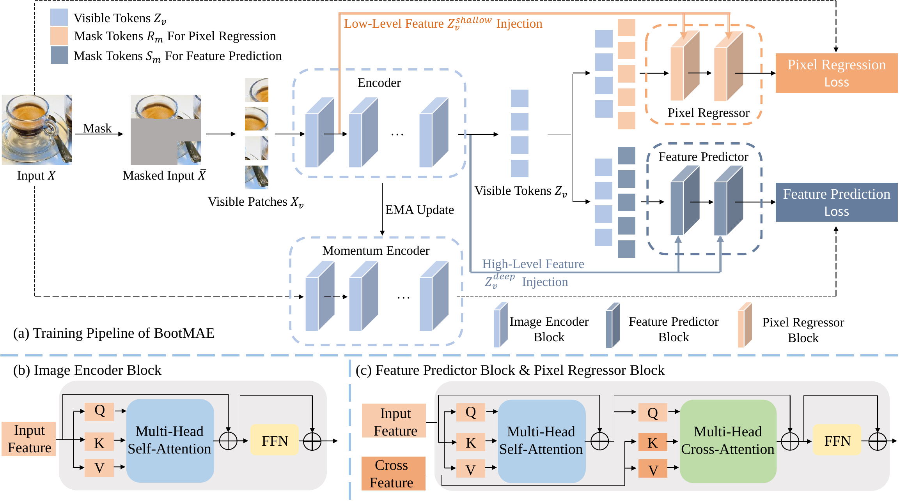

# BootMAE, ECCV2022

This repo is the official implementation of ["Bootstrapped Masked Autoencoders for Vision BERT Pretraining"](https://arxiv.org/abs/).

## Introduction

We propose bootstrapped masked autoencoders (BootMAE), a new approach for vision BERT pretraining. BootMAE improves the original masked autoencoders (MAE) with two core designs: 
1) momentum encoder that provides online feature as extra BERT prediction targets; 
2) target-aware decoder that tries to reduce the pressure on the encoder to memorize target-specific information in BERT pretraining. 



## Requirements

timm==0.3.4, pytorch>=1.7, opencv, ... , run:

```
bash setup.sh
```

## Results

| model | Pretrain Epoch | Pretrain Model | Linear acc@1 | Finetune Model | Finetune acc@1 |
|:---:  | :---:          |   :---:        |   :---:      | :---:          | :---:          |
| ViT-B | 800            | [model](https://github.com/LightDXY/BootMAE/releases/download/v0.1.0/BootMAE_Base_800_PT.pth)       |   66.1       | [model](https://github.com/LightDXY/BootMAE/releases/download/v0.1.0/BootMAE_Base_800_FT.pth)       | 84.2           |
| ViT-L | 800            | [model](https://github.com/LightDXY/BootMAE/releases/download/v0.1.0/BootMAE_Large_800_PT.pth)      |   77.1       | [model](https://github.com/LightDXY/BootMAE/releases/download/v0.1.0/BootMAE_Large_800_FT.pth)      | 85.9           |

See [Segmentation](https://github.com/LightDXY/BootMAE/tree/main/Segmentation) for segmetation results and config.

## Pretrain

The BootMAE-base model can be pretrained on ImageNet-1k using 16 V100-32GB:

```bash
OUTPUT_DIR=/path/to/save/your_model
DATA_PATH=/path/to/imagenet

run_pretraining.py \
    --data_path ${DATA_PATH} \
    --output_dir ${OUTPUT_DIR} \
    --model ${MODEL} \
    --model_ema --model_ema_decay 0.999 --model_ema_dynamic \
    --batch_size 256 --lr 1.5e-4 --min_lr 1e-4 \
    --epochs 801 --warmup_epochs 40 --update_freq 1 \
    --mask_num 147 --feature_weight 1 --weight_mask 

```
- `--mask_num`: number of the input patches need be masked.
- `--batch_size`: batch size per GPU.
- Effective batch size = `number of GPUs` * `--batch_size`. So in the above example, the effective batch size is `128*16 = 2048`.
- `--lr`: learning rate.
- `--warmup_epochs`: learning rate warmup steps.
- `--epochs`: total pre-training epochs.
- `--model_ema_decay`: the start model ema decay, we increase it to 0.9999 at the first 100 epoch
- `--model_ema_dynamic`: if True, further increase the ema from 0.9999 to 0.99999 at the first 400 epoch.
- `--feature_weight`: weight of the feature prediction branch
- `--weight_mask`: if True, assign larger loss weight to the center of the block region.

see [scripts/pretrain](https://github.com/LightDXY/BootMAE/tree/main/scripts/pretrain) for more config

## Finetuning
For finetuning BootMAE-base on ImageNet-1K

```bash
MODEL=bootmae_base
OUTPUT_DIR=/path/to/save/your_model
DATA_PATH=/path/to/imagenet
FINE=/path/to/your_pretrain_model

OMP_NUM_THREADS=1 python -m torch.distributed.launch --nproc_per_node=8 run_class_finetuning.py \
    --model ${MODEL} --data_path $DATA_PATH \
    --input_size 224 \
    --finetune ${FINE} \
    --num_workers 8 \
    --output_dir ${OUTPUT_DIR} \
    --batch_size 256 --lr 5e-3 --update_freq 1 \
    --warmup_epochs 20 --epochs 100 \
    --layer_decay 0.6 --backbone_decay 1 \
    --drop_path 0.1 \
    --abs_pos_emb --disable_rel_pos_bias \
    --weight_decay 0.05 --mixup 0.8 --cutmix 1.0 \
    --nb_classes 1000 --model_key model \
    --enable_deepspeed \
    --model_ema --model_ema_decay 0.9998 \

```
- `--batch_size`: batch size per GPU.
- Effective batch size = `number of GPUs` * `--batch_size` * `--update_freq`. So in the above example, the effective batch size is `16*64*2 = 2048`.
- `--lr`: learning rate.
- `--warmup_epochs`: learning rate warmup epochs.
- `--epochs`: total pre-training epochs.
- `--clip_grad`: clip gradient norm.
- `--drop_path`: stochastic depth rate.


see [scripts/finetune](https://github.com/LightDXY/BootMAE/tree/main/scripts/finetune) for more config

## Linear Probing
For evaluate linear probing accuracy of BootMAE-base on ImageNet-1K with 8 GPU

```bash
OUTPUT_DIR=/path/to/save/your_model
DATA_PATH=/path/to/imagenet
FINETUNE=/path/to/your_pretrain_model

LAYER=9

OMP_NUM_THREADS=1 python -m torch.distributed.launch --nproc_per_node=8 \
        main_linprobe.py \
        --batch_size 1024 --accum_iter 2 \
        --data_path ${DATA_PATH} --output_dir ${OUTPUT_DIR} \
        --model base_patch16_224 --depth ${LAYER} \
        --finetune ${FINETUNE} \
        --global_pool \
        --epochs 90 \
        --blr 0.1 \
        --weight_decay 0.0 \
        --dist_eval 

```
- `--batch_size`: batch size per GPU.
- Effective batch size = `number of GPUs` * `--batch_size` * `--accum_iter`. So in the above example, the effective batch size is `8*1024*2 = 16384`.
- `--blr`: base learning rate. the learning rate is --blr * effective batch size / 256
- `--epochs`: total pre-training epochs.
- `--depth`: index of the layer to evaluate

see [scripts/linear](https://github.com/LightDXY/BootMAE/tree/main/scripts/linear) for more config


# Acknowledgments

This repository is modified from [BEiT](https://github.com/microsoft/unilm/tree/master/beit), built using the [timm](https://github.com/rwightman/pytorch-image-models) library, the [DeiT](https://github.com/facebookresearch/deit) repository and the [Dino](https://github.com/facebookresearch/dino) repository. The linear probing part is modified from [MAE](https://github.com/facebookresearch/mae).


# Citation
If you use this code for your research, please cite our paper.
```

```


